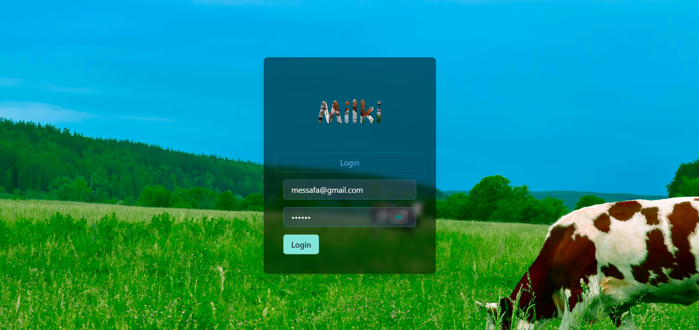
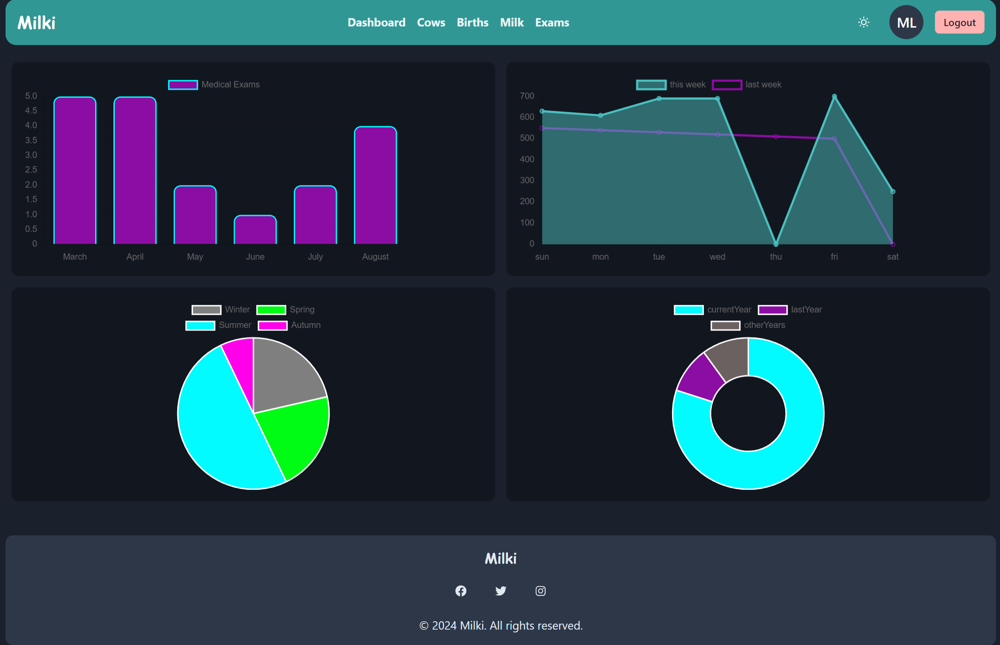
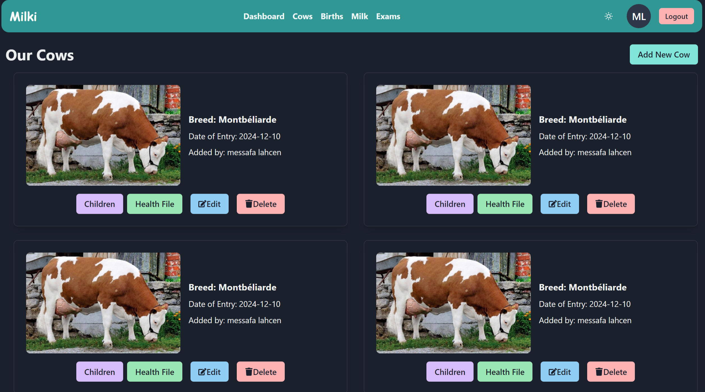
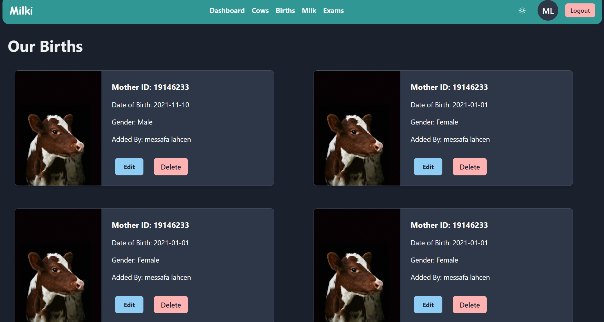
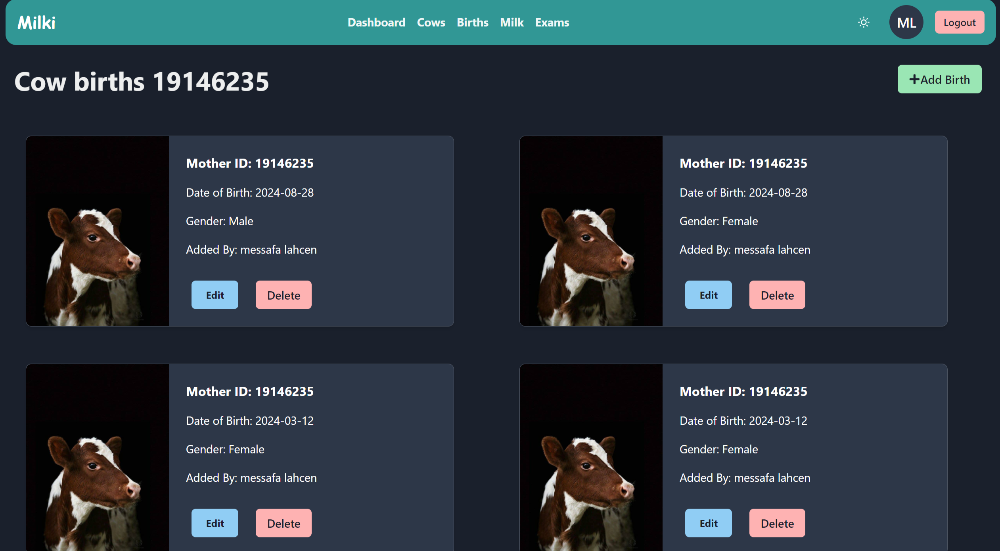
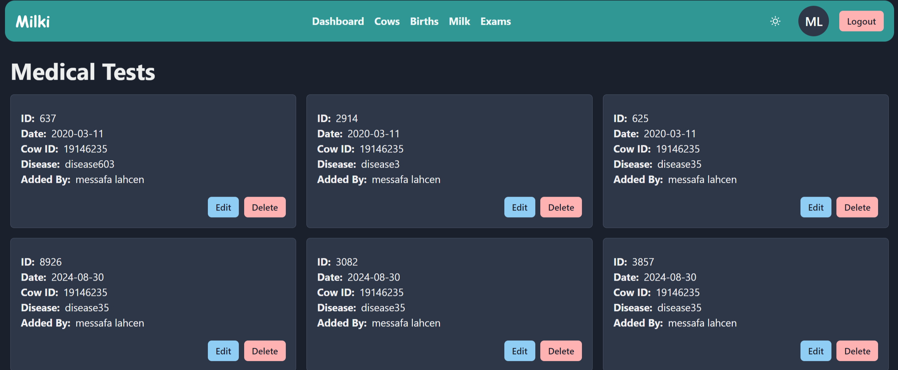
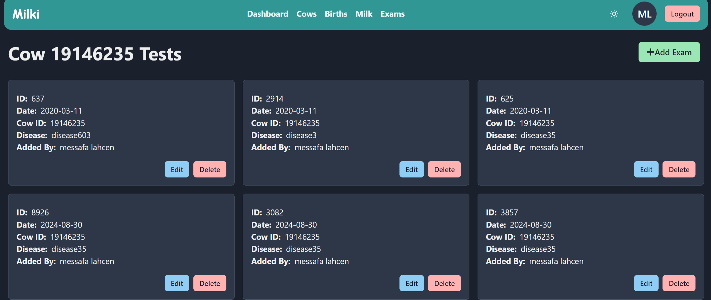
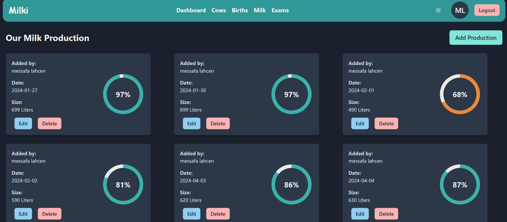

# HALAT_BARMADJA: Farm Management System

This full-stack web application, built with **Vite** **React** on the frontend and **Node.js** with **Express.js** on the backend, manages dairy farm operations like cow registration, medical exams, birth records, and daily milk production, storing data in **JSON files** via the **FS module**, and is fully responsive across all devices with support for light and dark mode toggling.

## Contents

- [Highlights](#highlights)
- [Overview](#overview)
- [Setup Guide](#setup-guide)
- [Configuration](#configuration)
- [Launching the System](#launching-the-system)
- [API Routes](#api-routes)
- [Visuals](#visuals)

## Highlights

- **Dashboard**: Visualize key metrics with interactive charts and graphs.
- **Cow Management**: Register cows, track medical exams, and monitor milk production.
- **Birth Records**: Record calving dates, calf details, and other relevant information.
- **Milk Production**: Log daily milk production data and view weekly summaries.
- **Medical Exams**: Schedule and record health exams for cows 
- **Comprehensive API**: Access a wide range of endpoints for managing farm data.
- **Secure Authentication**: Protect sensitive data with JWT-based authentication.
- **Data Persistence**: Store data in JSON files for easy management and portability.

## Overview
```
project-root/
│
├── server/
│   ├── config/
│   │   └── config.js                 // Configuration settings 
│   │
│   ├── controllers/
│   │   ├── authController.js         // Handles user authentication and authorization
│   │   ├── birthController.js        // Manages birth records
│   │   ├── cowController.js          // Manages cow data
│   │   ├── examController.js         // Manages medical exam records
│   │   └── milkProductionController.js // Manages milk production records
│   │
│   ├── database/
│   │   ├── births.json               // Stores birth records
│   │   ├── cows.json                 // Stores cow records
│   │   ├── exams.json                // Stores medical exam records
│   │   ├── milkProductions.json      // Stores milk production records
│   │   └── users.json                // Stores user(workers) data for authentication
│   │
│   ├── middlewares/
│   │   ├── authMiddleware.js         // Middleware for handling authentication
│   │   ├── errorHandler.js           // Middleware for centralized error handling
│   │   └── securityMiddleware.js     // Middleware for additional security measures
│   │
│   ├── routes/
│   │   ├── authRoutes.js             // Routes for authentication and authorization
│   │   ├── birthRoutes.js            // Routes for birth records
│   │   ├── cowRoutes.js              // Routes for cow records
│   │   ├── examRoutes.js             // Routes for medical exams
│   │   └── milkProductionRoutes.js   // Routes for milk production records
│   │
│   ├── utils/
│   │   ├── cowExamUtils.js           // Utility functions related to cow exams
│   │   ├── errors.js                 // Error handling utility functions
│   │   ├── jsonUtils.js              // Utility functions for working with JSON files
│   │   └── jwtUtils.js               // Utility functions for handling JWT 
│   │
│   ├── .env                          // Environment variables
│   ├── .gitignore                    // Git ignore file
│   ├── app.js                        // Main Express application setup
│   ├── package-lock.json             // Auto-generated, locks dependencies versions
│   └── package.json                  // Project metadata and dependencies
```

## Setup Guide

1. **Clone the Project:**

   `git clone https://github.com/messafa/HALAT_BARMADJA.git`

   `cd HALAT_BARMADJA`
   

2. **Install Dependencies:**

   `cd client`
   `npm install`  or  `npm i`

   `cd ..`
   `cd server` 
   `npm i`
   

3. **Configuration:**

Create a `.env` file at the root directory with the following content:

plaintext
PORT=5001
JWT_SECRET=3x@mpl3$3cr3tK3y!2024#S3cur3


## Launching the System

1. **Start the Server:**

   bash
   `npm run server`

2. **Start the Client:**

   bash
   `npm run dev`

**OR**
  
  go to server file
  `npm start dev`     // here I use concurrently for run the client and server by one commend only
   

Access the client at `http://localhost:5173`.

Server will be run at `http://localhost:5001`.

## API Routes

### Cows

- **Add Cow**:       `POST    /cows`
- **Retrieve Cow**:  `GET     /cows/:id`
- **List Cows**:     `GET     /cows`
- **Update Cow**:    `PATCH   /cows/:id`
- **Remove Cow**:    `DELETE  /cows/:id`
- **Yearly Cows**:   `GET     /cows/data/yearly`

### Health Exams

- **Add Exam**:         `POST    /exams`
- **Retrieve Exam**:    `GET     /exams/:id`
- **List Exams**:       `GET     /exams`
- **Update Exam**:      `PATCH   /exams/:id`
- **Remove Exam**:      `DELETE  /exams/:id`
- **Exams by Cow**:     `GET     /exams/cow/:cowId`
- **Last Six Months**:  `GET     /exams/data/lastSixMonths`

### Birth Records

- **Add Record**:       `POST    /births`
- **Retrieve Record**:  `GET     /births/:id`
- **List Records**:     `GET     /births`
- **Update Record**:    `PATCH   /births/:id`
- **Remove Record**:    `DELETE  /births/:id`
- **Births by Cow**:    `GET     /births/cow/:cowId`
- **Births in Season**: `GET     /births/data/season`


### Milk Production

- **Add Production**:       `POST    /milk`     
- **Retrieve Production**:  `GET     /milk/:id`
- **List Productions**:     `GET     /milk`
- **Update Production**:    `PATCH   /milk/:id`
- **Remove Production**:    `DELETE  /milk/:id`
- **Maximum Production**:   `GET     /milk/data/max`
- **This Week's Data**:     `GET     /milk/data/thisweek`
- **Last Week's Data**:     `GET     /milk/data/lastweek`

## Visuals

**Login Page**

**Dashboard**

**Our Cows**

**All Births**

**Births of Special cow**

**All Medical Exams**

**Medical Exams of Special cow**

**Milk prodiction Page**
